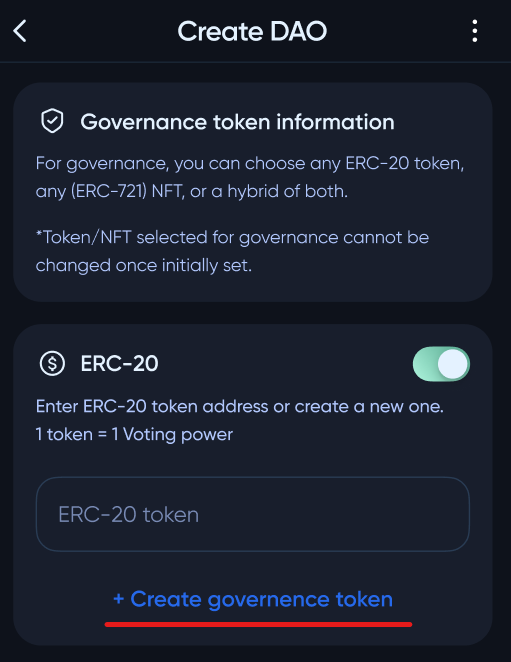
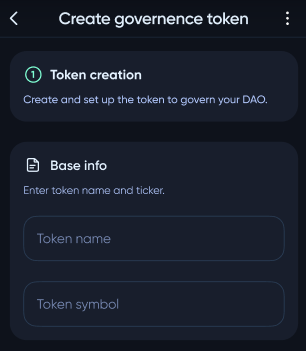
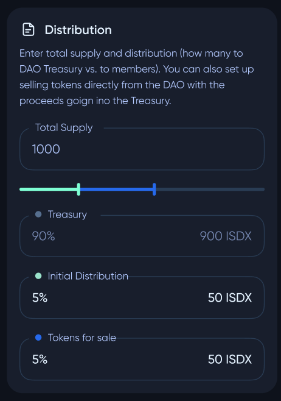
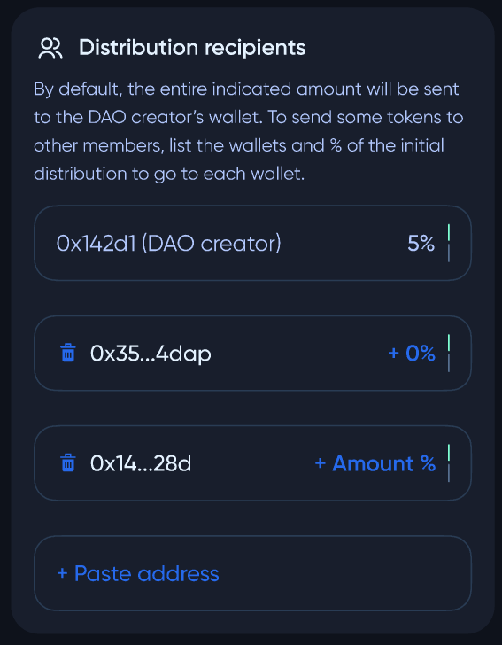
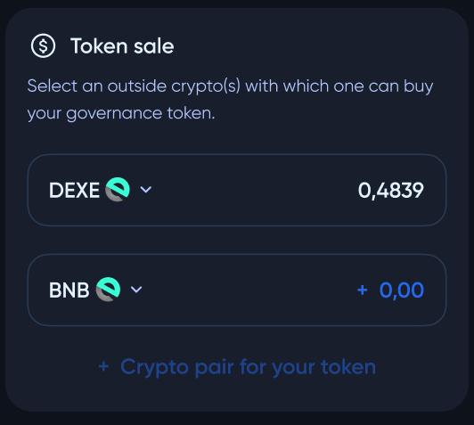

# Creating a governance token

While creating a **DAO** (`UserGuide/CreateDAO`), a user may need to create a governance token first.

#

The first step is to fill in basic information about the token - a token name and a symbol.

The next step is to configure the token distribution parameters.

***Total supply*** - the total amount of minted governance tokens

***Treasury*** - part of supply that will go to **DAO** pool treasury

***Initial Distribution*** - part of supply that will be distributed to **DAO** members immediately after **DAO** creation.

***Tokens for sale*** - tokens that will be sold (exchanged for other tokens) to other users

By default, the entire amount of the ***Initial Distribution*** tokens will be sent to the **DAO** creator's wallet. To reconfigure this, use the `Distribution recipients` panel.

In the `Token sale` panel, the pool creator can select tokens that can be used to buy the **DAO** native tokens and configure exchange rates.

To see how to buy a **DAO** pool token, visit `UserGuide/BuyDAOToken`.
