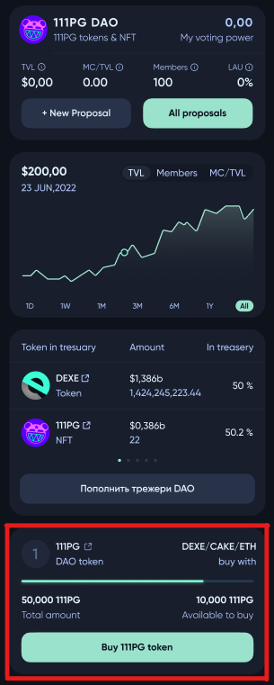
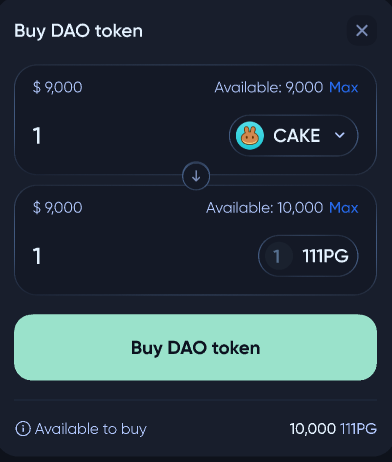

# 💰 Buying DAO tokens on a token sale

To buy a **DAO** pool token, the user needs to visit the profile of this **DAO**. There, the user will be able to see the token sale proposals if there are any. 

In the token sale proposal, the user will be able to conduct an exchange using some token from the token sale proposal list to acquire **DAO** tokens. After selecting tokens and their amount to be exchanged, press ***Buy DAO token***.

If you manage to successfully purchase **DAO** tokens, you will become a member of this **DAO**.

