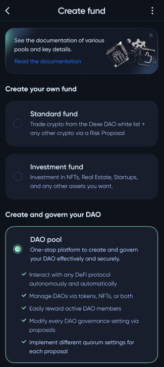
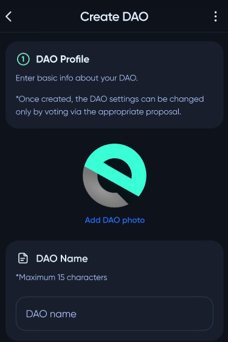
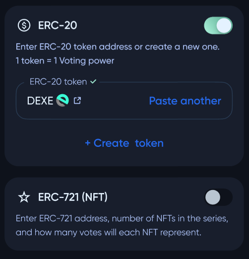
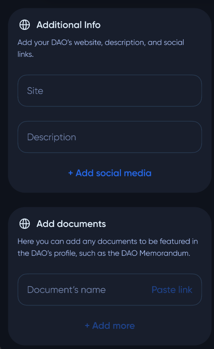
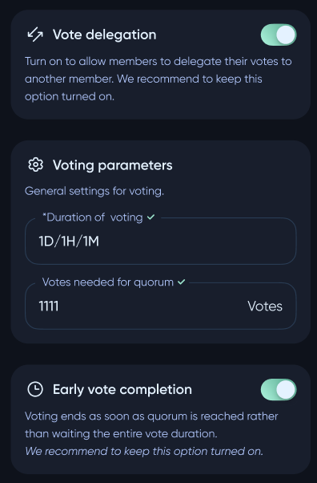
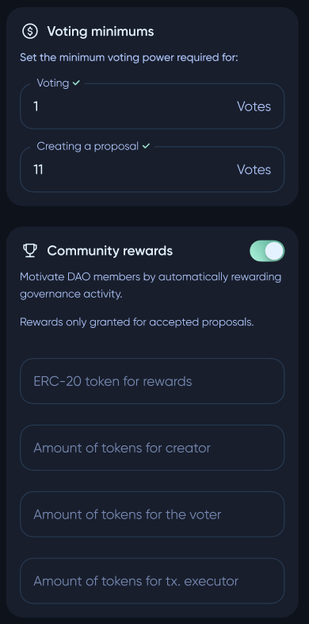
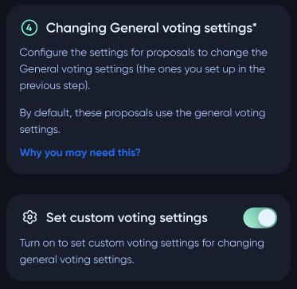
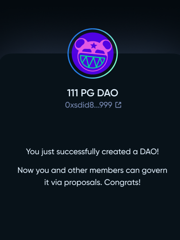

# 🏛 Creating a DAO pool

To create a **DAO pool**, a user needs to enter the `Create fund` page and select the "***DAO pool***" option.

#

The next step is configuring the **DAO pool** profile. The user needs to input the name and logo of the pool. If no logo image is uploaded, the **DeXe** logo will be used.

⠀

#

For governance, the user can choose any **ERC-20** token, any **ERC-721** **NFT**, or a hybrid of both. Token creation guidance is located in `UserGuide/DAO/CreateToken`.

The user can set additional descriptions and documentation for the pool.

## DAO validator settings

On this page, the user can designate trusted **DAO** members to serve as validators, who will hold a validator-only second vote on every passed proposal to filter out potentially malicious proposals. Validators vote using a separate token that can be created and distributed here. 

❗ Once the pool is created, validator settings can be modified only by validator voting.

***Duration of voting*** - time limit for the validators to vote on a validator proposal.

***Quorum required for a vote to pass*** - % of validator tokens that must vote for the voting decision to get passed.

## Voting settings

On this page, the user can configure the settings for proposals, voting, vote delegation, and rewards for activity in the **DAO**.

***Vote delegation*** is useful if some member of the **DAO** does not want to vote for proposals on his own. This user can delegate part of his funds to another user and receive rewards.

## Changing general voting settings

While creating a **DAO**, the user can configure to change the general voting settings. For example, it can be used to set up a higher barrier for proposals that change the general voting settings to avoid abuse and to be voted on by only large token holders (the user can set the minimum voting threshold to a higher level than in the general voting settings).

## DAO created

