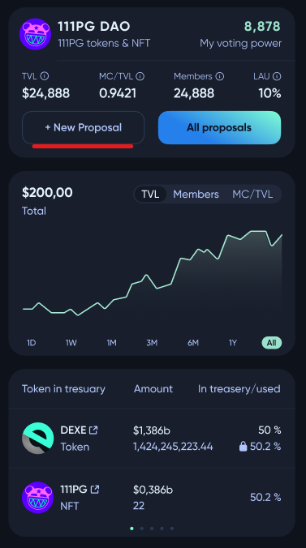
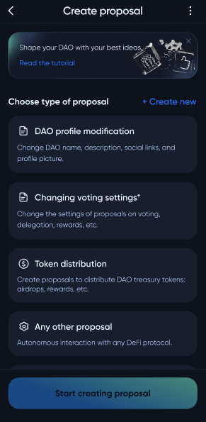
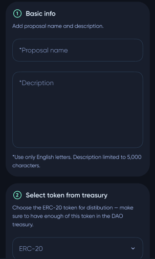
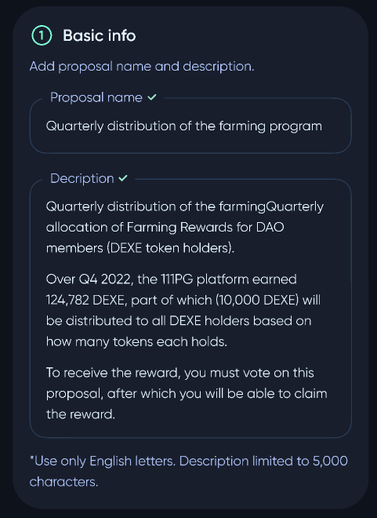
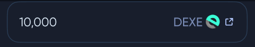
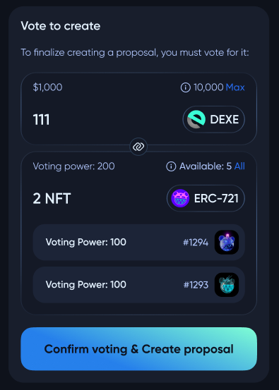
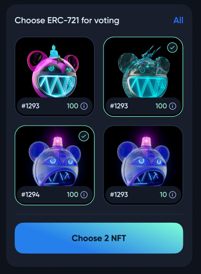
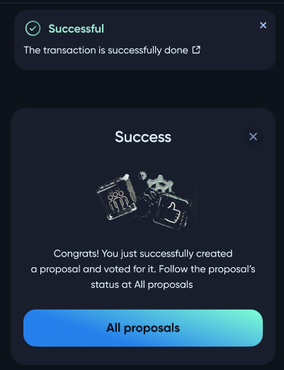

# 🗳️ Creating a proposal

To create a proposal in some **DAO**, the user needs to visit the profile of that **DAO** and click the ***+ New Proposal*** button.

On this page, the user must select the type of proposal.

There are different types of proposals:
- **DAO** profile modification
- Changing voting settings
- Token distribution
- Any other proposal (autonomous interaction with any **DeFi** protocol)
- Validator settings
- Token sale (see `UserGuide/DAO/TokenSale`)

An example of the creation of the *Token distribution* proposal.

The user should enter the proposal name, and description, and select which token and the amount that is going to be distributed among the **DAO** members.

To finalize creating a proposal, the user must give it a certain number of initial votes (defined in the **DAO** settings). So, the next step is to vote for that proposal with the user's tokens.

If the user has enough voting power, he will be able to create a proposal.

