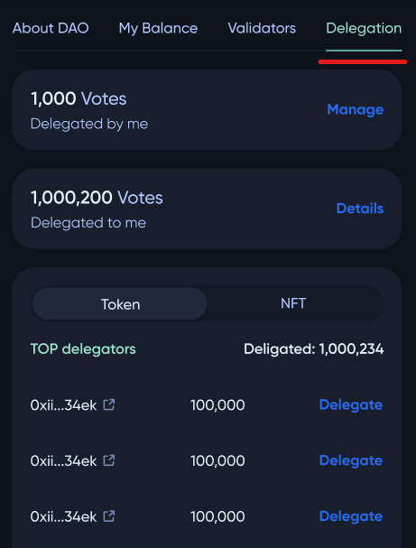
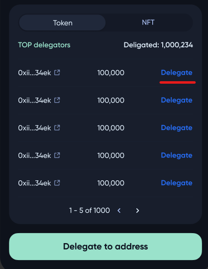
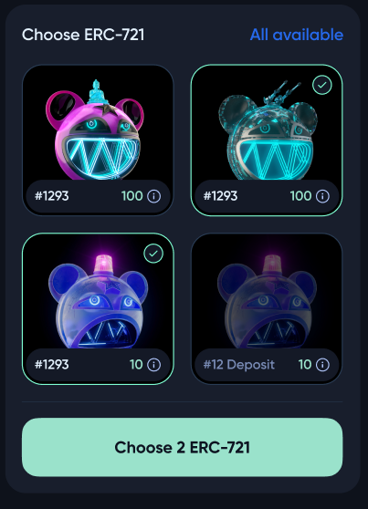
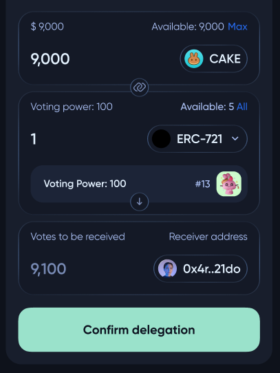

# Delegating a DAO token

The delegation panel is located on the **DAO** profile page in ***Delegation***.

Here, the user can check the number of tokens delegated **TO** and **BY** this user.

Also, the user can review the list of **DAO** pool delegators and delegate a certain number of tokens to them using the ***Delegate*** button.

On the delegation panel, the user should choose tokens that are going to be delegated to another **DAO** member and enter ***Confirm delegation***.

