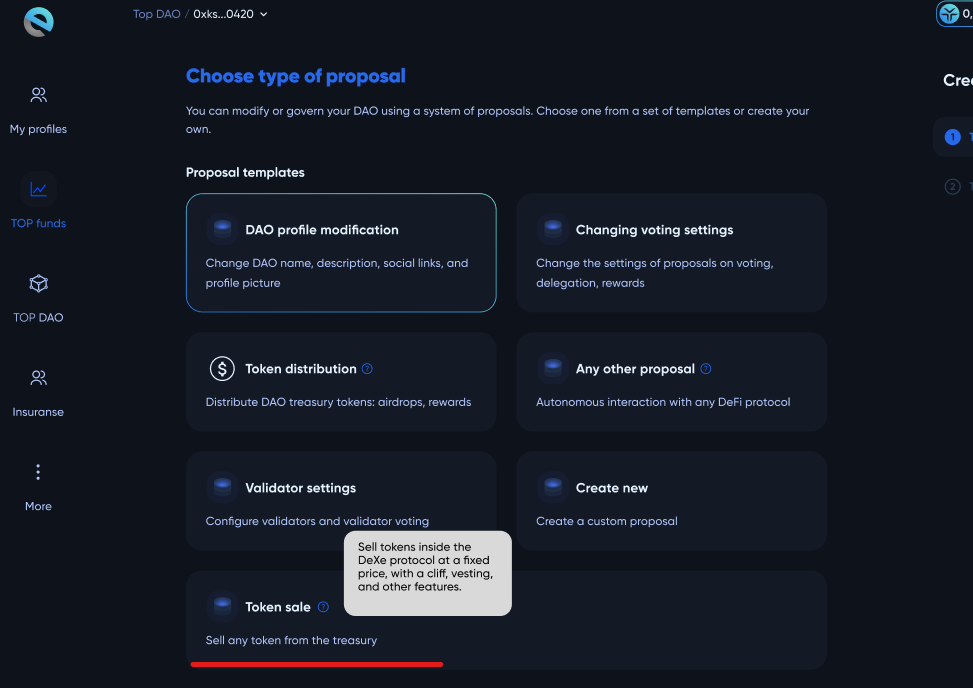
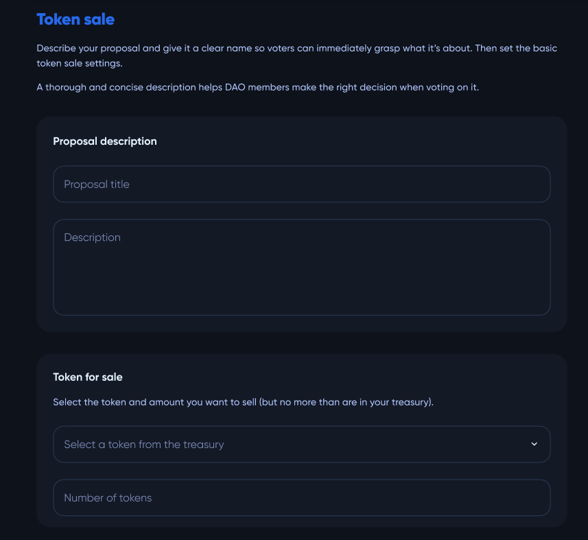
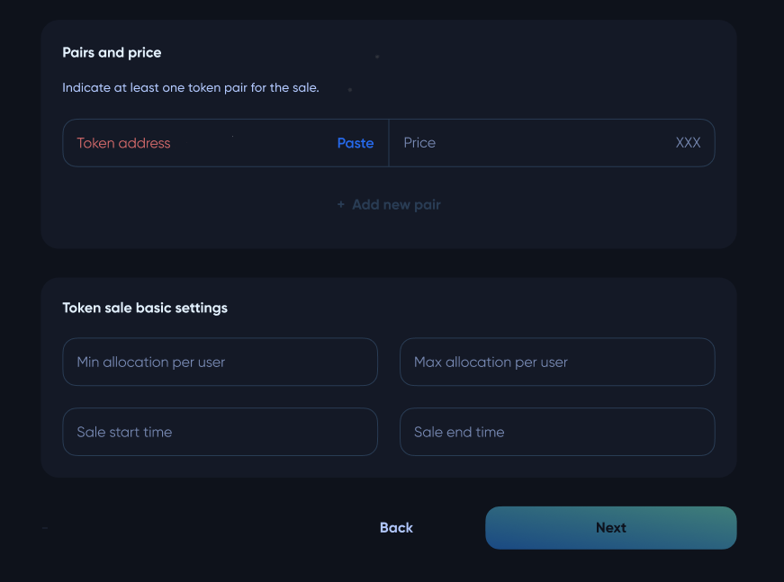
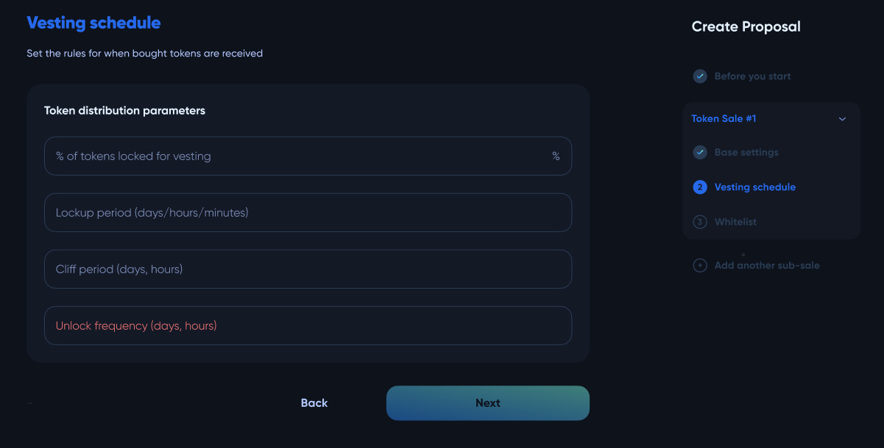
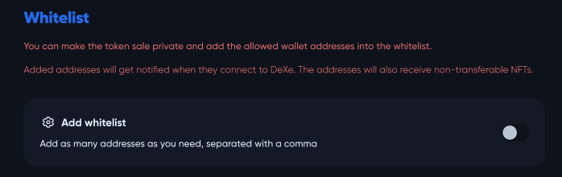
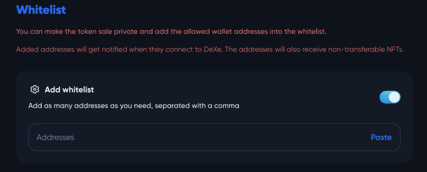

# Token Sale

**DAO** pools could create their own **ERC-20** token and sell it to investors via custom sale logic.

A token sale proposal can be created on the `Create proposal` panel (on the **DAO** profile page).

The proposal configuration requires the creation of a description, selection of a token and its amount from the treasury, as well as setting the exchange rate and basic token sale parameters such as the minimum and maximum allocation per user, and the start and end times of the sale.

The user must also configure vesting settings, which involves locking and distributing purchased tokens over a specified period. Vesting parameters include the percentage of locked tokens, lockup duration, cliff period (when no tokens are distributed), and unlock frequency.

The token sale can be either private or public. In case of a private sale, the user must input the addresses on the whitelist that are authorized to participate.

