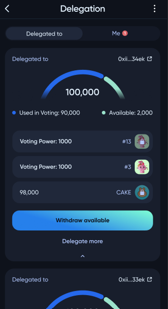
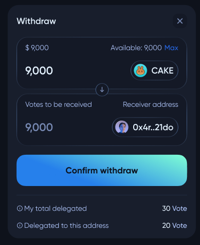
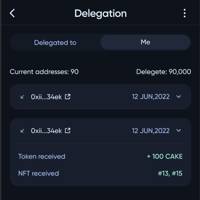

# Delegation

On the `Delegation` page, the user can review his delegated tokens, withdraw them, or delegate more. If you want to know how to find delegators and delegate tokens to them, visit the `UserGuide/DelegateDAOToken` page.

If the user wants to withdraw tokens, he needs to use the `Withdraw available` button and then confirm the withdrawal.

The user can also review tokens that were delegated to him.

