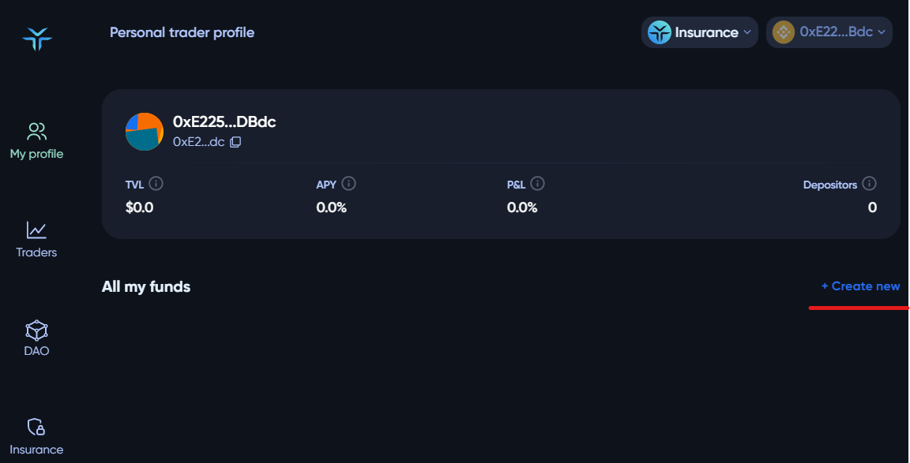
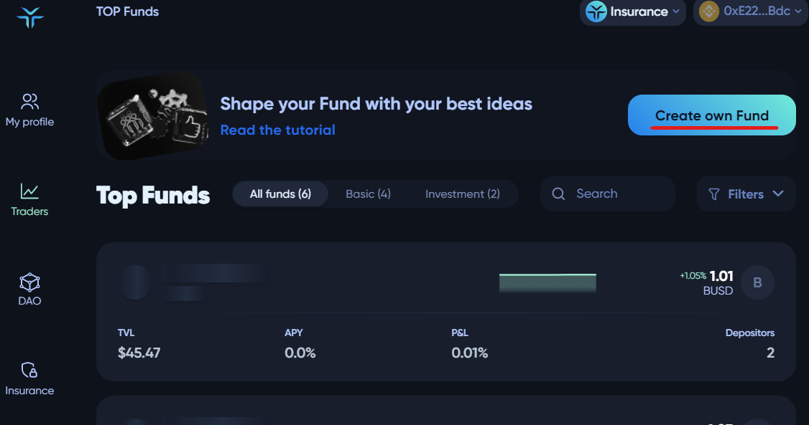
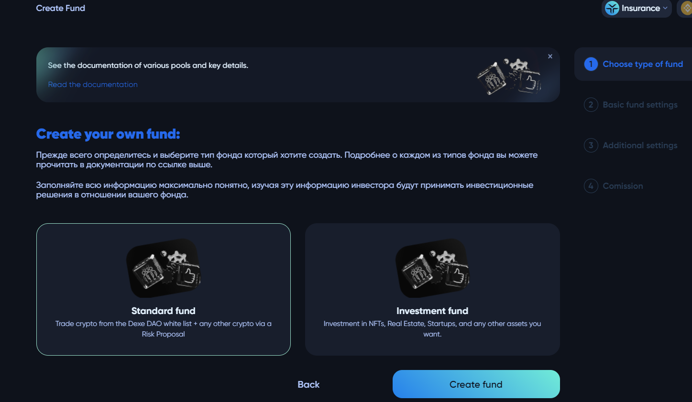
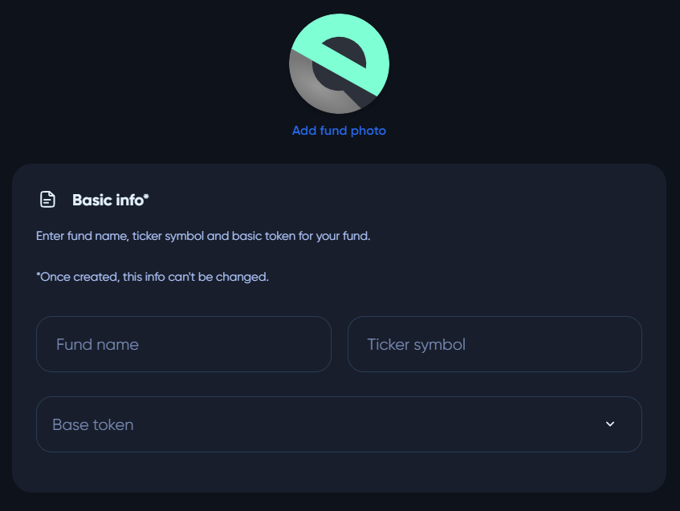
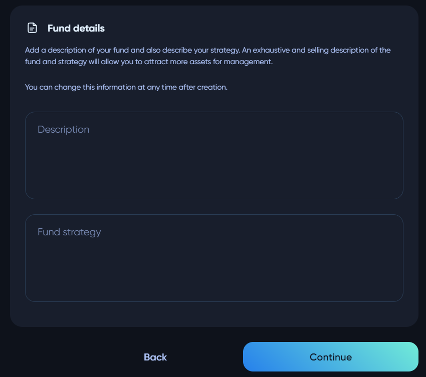
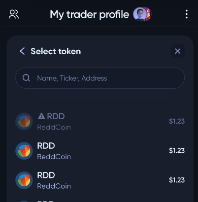
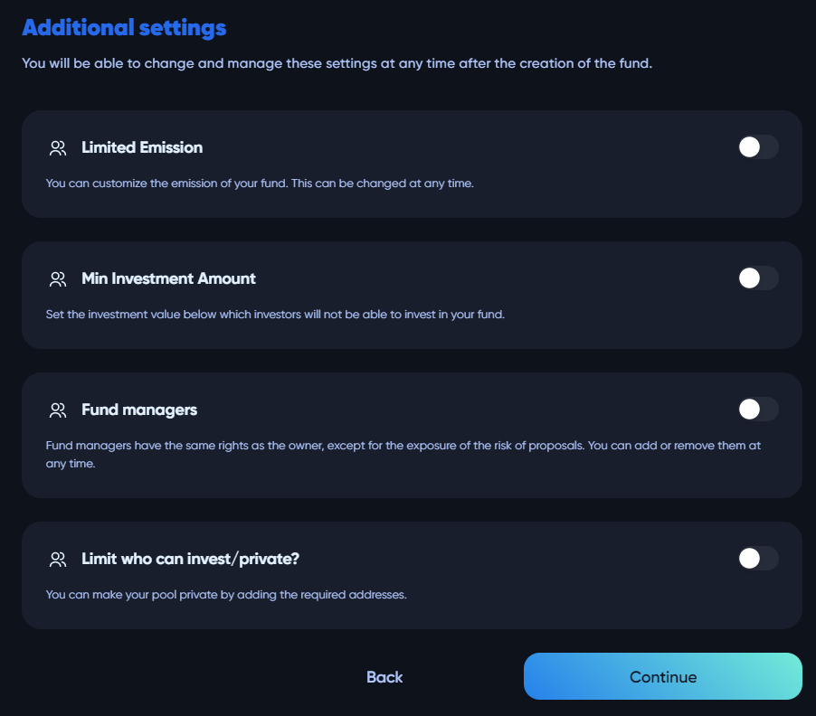
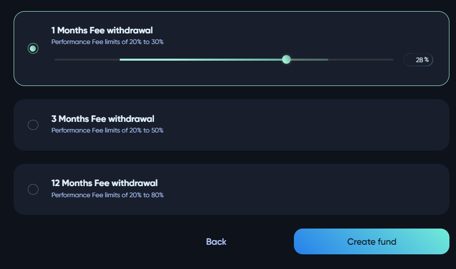
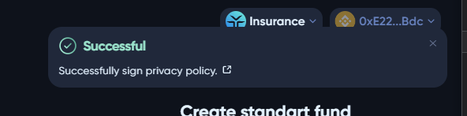

# 🏢 Creating a fund

There are two types of a fund - standard and investment. The standard fund is used to trade crypto from the **Dexe DAO** whitelist (and any other token via a *Risk Proposal*), while the investment fund is used to invest in real estate, NFTs, startups, etc.

To create a fund, the trader should enter the `My profile` page and select `Create new` in the fund list or `Create own Fund` on the `Traders` page.

The next step is to select the type of fund.

After selecting the type of fund, the user should enter basic information about the fund (name, ticker symbol, base token, description, and strategy).

Only the whitelisted tokens can act as a base token for a fund.

Additional settings are not mandatory to create a pool, but with their help, a trader can fine-tune his pool. Parameters are **limited emission** (sets limits on the maximum amount of fund token), **minimal investment amount** (for investors), **fund managers** (owner can include several managers that can also trade using whitelisted tokens), and **whitelist of investors** (owner can make pool private, only whitelisted members can invest).

The fund collects an interest fee upon profits. The less often the owner withdraws a profit, the higher the commission he can make.

#

