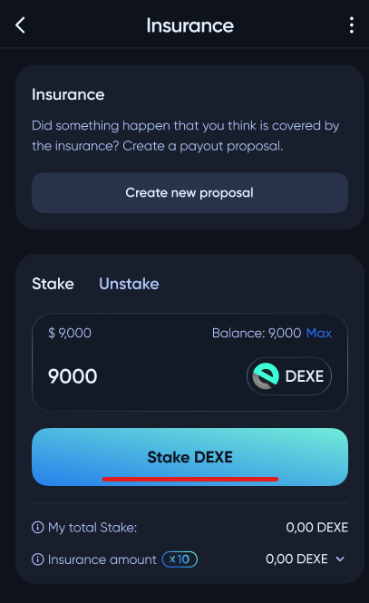
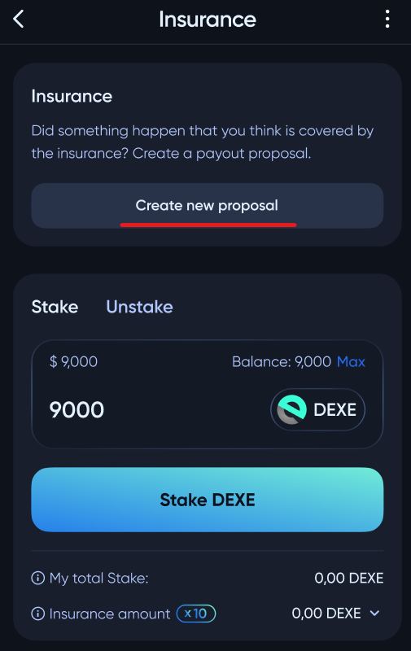

# Insurance

Insure your investments against fund losses. To apply for insurance, you need to stake ***10%*** of the desired insurance amount in **DEXE** token (but not less than **100** **DEXE**). You can cancel the insurance at any time by withdrawing **DEXE** tokens from staking.

❗ Depositing funds into the insurance pool does not guarantee payment, but only allows the user to participate in the compensation. The decision to provide compensation is made through voting by **DeXe DAO** members.

To create a proposal for insured event compensation, use the `Create new proposal` button.

