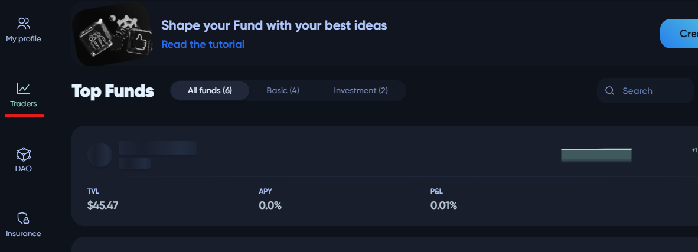
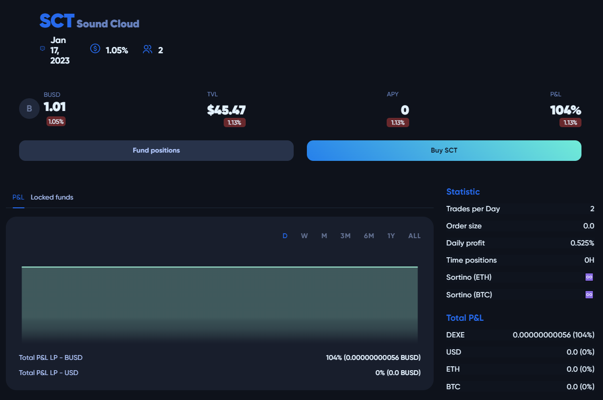
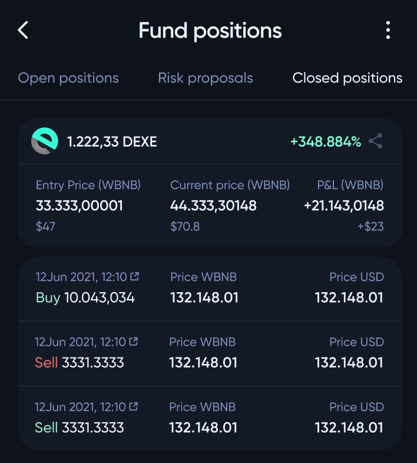
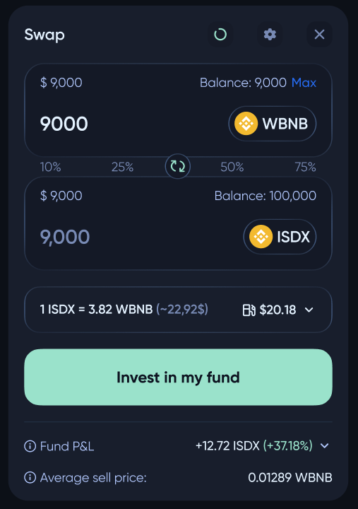

# 💰 Investing in the funds

If the user wants to invest in an existing fund, the first step is to select the desired fund. To review the list of all funds, use the `Traders` page.

The fund page provides users with important information about the investment fund, including its statistics, description, and participants. To become a member of the fund, the user must purchase its **LP** tokens using the base token. The **LP** token signifies ownership of a portion of the fund and gives the holder access to view the fund's positions in the "Fund Positions" panel. 

The panel provides insight into the assets the fund is invested in, their value, and the weight each position holds in the overall portfolio. In addition, the fund's statistics, such as performance and returns, can be reviewed on the same page or on a separate statistics page. The fund's description provides a detailed overview of the investment strategy, objectives, risk profile, and other important information to assist the user in making an informed investment decision.

❗ If there are some open positions in the fund, the investor's **base** tokens will be automatically exchanged proportionally to open positions.

If the fund is performing well and trading at a profit, the investor can sell their **LP** tokens and receive a corresponding increase in the base token. On the other hand, if the fund is trading at a loss, the investor will receive fewer base tokens when they sell their **LP** tokens.

The process of buying **LP** tokens is typically done through a standard token-exchange interface, which allows for the seamless exchange of tokens and the tracking of investments in real-time. This makes it easy for investors to monitor their investments and make informed decisions about when to buy or sell **LP** tokens.

