# 💱 Trader

The first step for a trader is creating a fund. The process is described on the `UserGuide/CreateFund` page.

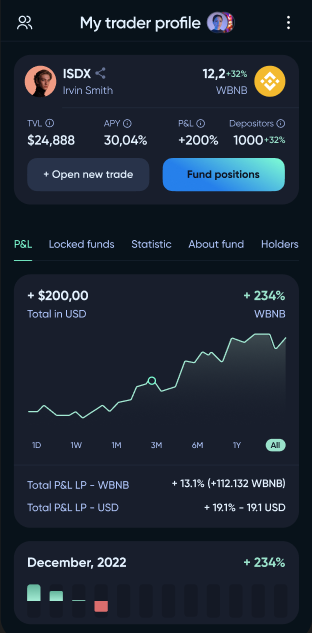

A trader can manage multiple funds. The list of these finds is located on the trader profile page.

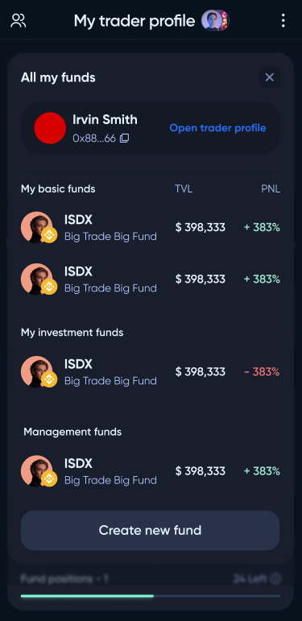
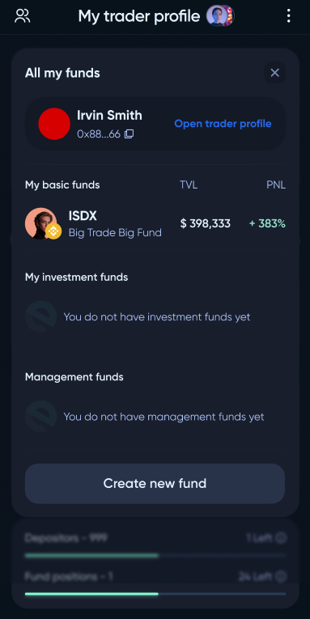

To start trading and open new positions, the trader must click `Open new trade` on the fund page.

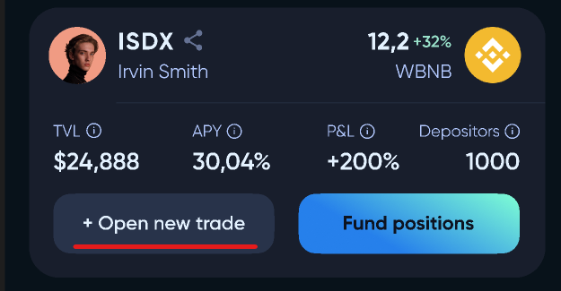

The trading interface is similar to a regular swapper.

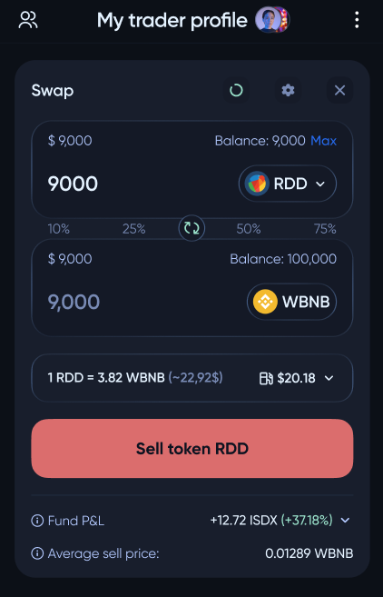
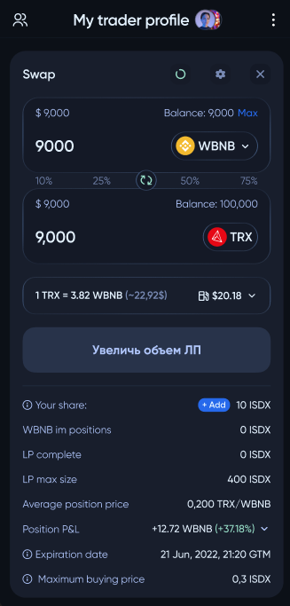

There is a list of tokens approved by **DeXe DAO** (the whitelist). They are considered safe, and a trader can work with them without restrictions.

If a trader wants to invest in a non-whitelisted token, a risk proposal is automatically created.

⚠️⚠️ In a risky pool, traders can trade any token, even those created by them, and add liquidity to **Uniswap**. This allows the trader to always be in profit by selling their tokens at a higher price, and closing **DeXe** trades at a loss.

When creating a risky proposal, you stake your **LP** tokens and indicate the volume of the token you wish to buy immediately as you create the risk proposal: from **0%** to **100%**, where **0%** means you can buy with your own **LP** tokens all the tokens later (maybe because you're waiting for a better entry price) while **100%** will get the entire desired token amount right when you create the risk proposal.

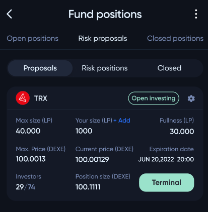

Following the creation of the risk proposal, your investors will be notified and will be able to invest up to the same **%** of the original pool as you did by staking their **LP** tokens.

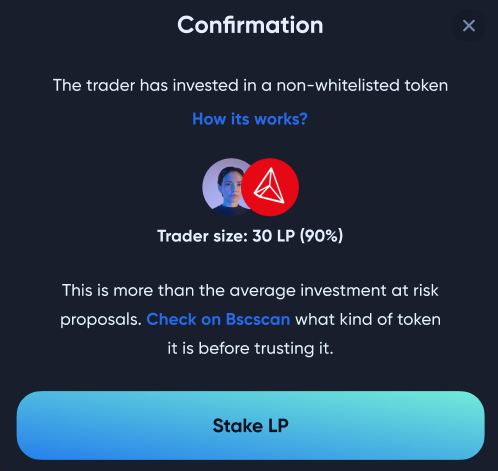

The investors will opt into this risk proposal in the same way (if you buy **100%** right away, so will they once they opt in). After creating the risk proposal, you purchase the risk token (token not in the whitelist) using your fund's base tokens and open positions in your regular pool (open positions will be closed proportionately based on the volume of the risk token you wish to buy).

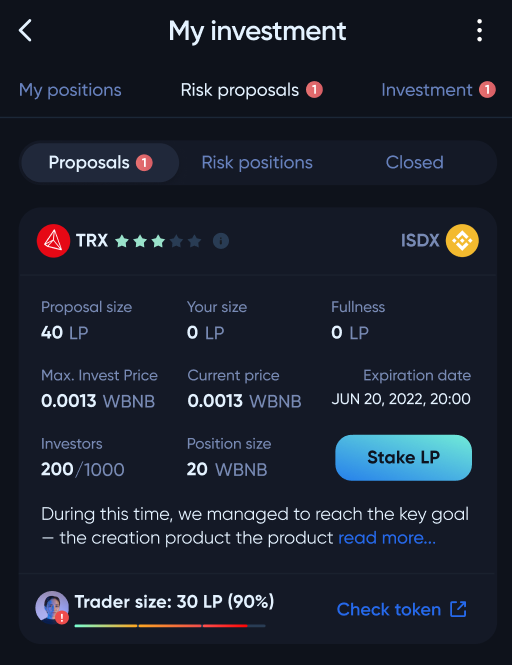

Every new staking or investment in a risk proposal creates a market transaction.

❗ *The average price of a purchased asset is the same for everyone in the pool and gets updated for everyone with each new investment.* 

For this reason, you can limit the maximum market price the risk proposal is willing to pay for a token. If the price is above the maximum, investors won't be able to stake **LP** and buy the token until the price falls below the threshold. You can also limit the time window during which investors can opt into a specific risk proposal.

The trader has the flexibility to close the position at any time, and the profit or loss from the risk proposal is credited to the investor's account after they withdraw their **LP** from the risk proposal. This allows investors to track their returns and make informed decisions about their investments.

#

If a trader wants to invest in off-chain assets (like real estate or startups), he should create an Investment fund (see `UserGuide/Investments/CreateFund`) and periodically pay dividends to the investors.

⚠️⚠️ Investment fund allows traders to **WITHDRAW ALL** user's investments from the pool. There is **NO** guarantee that users would be able to receive their funds back. Invest only in funds you can trust.

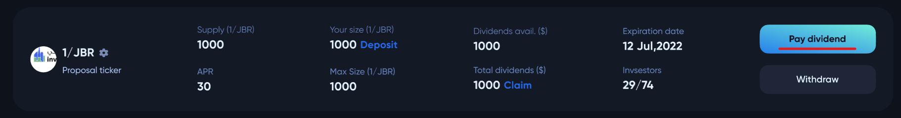

#

The owner of the fund can change its settings. An investor can be deleted from a private fund only if he has no assets in it. The base token of the fund cannot be changed. 

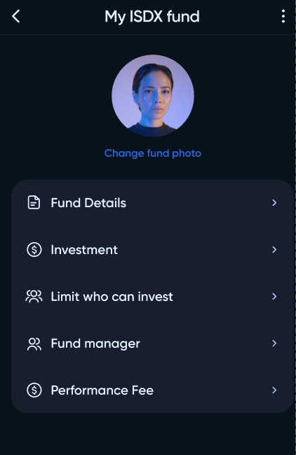
