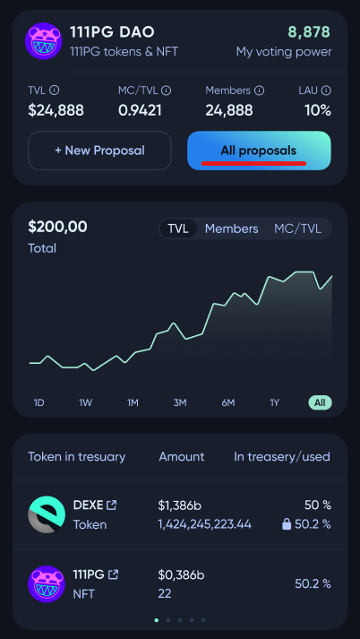
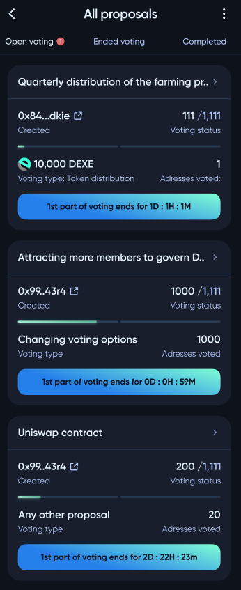
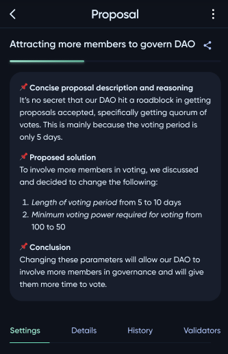
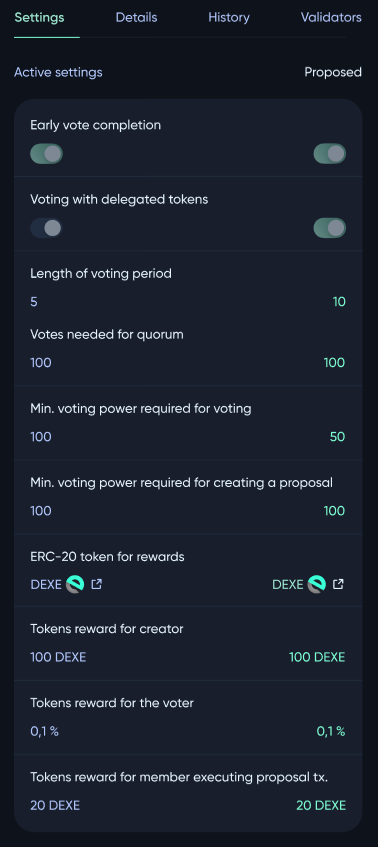
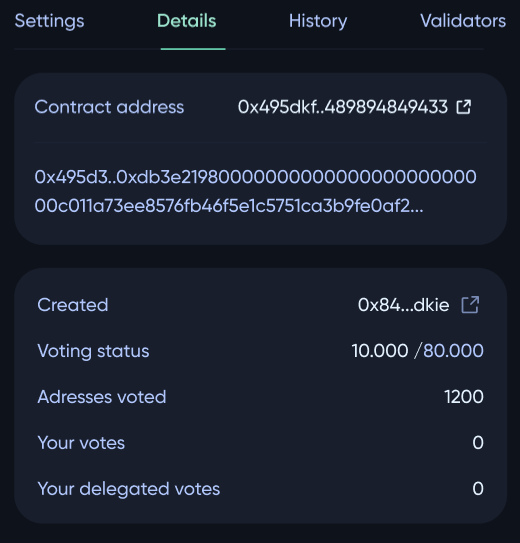
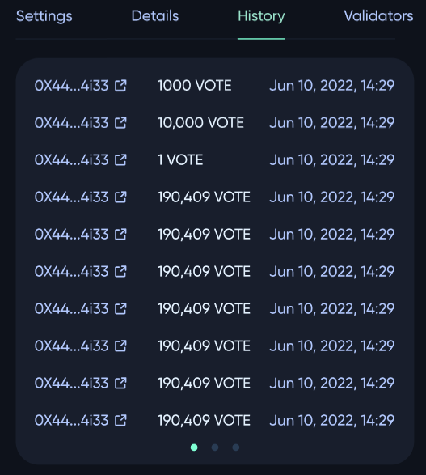
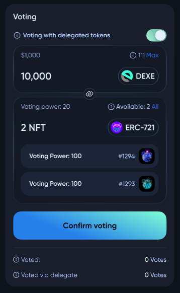
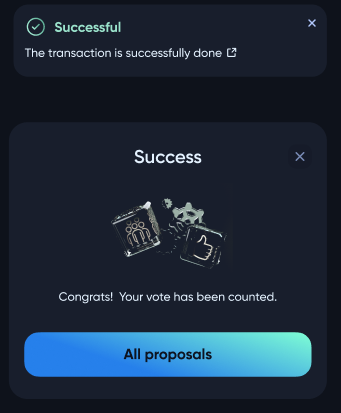

# Voting for proposal in DAO

To vote for a proposal in some **DAO**, the user needs to visit the profile of that **DAO** and click the ***All proposals*** button.

Here, the user will see all open proposals. 

After clicking on the name of a proposal, the user can get more details about that proposal.

On the first page, the user can see the goal of the proposal. In the example, the goal of the proposal is to change the **DAO** voting settings.

There are other pages: *Details*, *History*, and *Validators*.

At the bottom of the page, users can participate in voting using owned and delegated tokens.

After the transaction is completed, the user's vote is taken into account. In case of acceptance of the proposal, the user will receive a reward according to the **DAO** settings.

