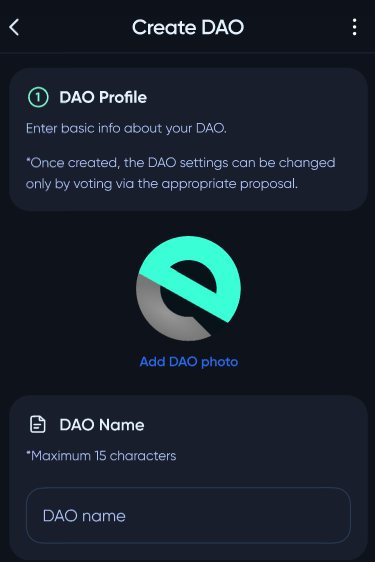
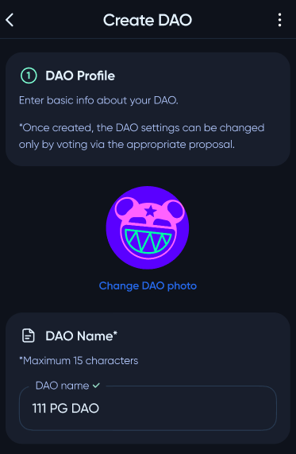

# User Guide

## Creating a DAO pool

To create a **DAO pool**, user needs to enter `Create fund` page and select "***DAO pool***" option.

The next step is configuring **DAO pool** profile. User need to input name and logo of pool. If no logo image uploaded, the **DeXe** logo will be used.

⠀

