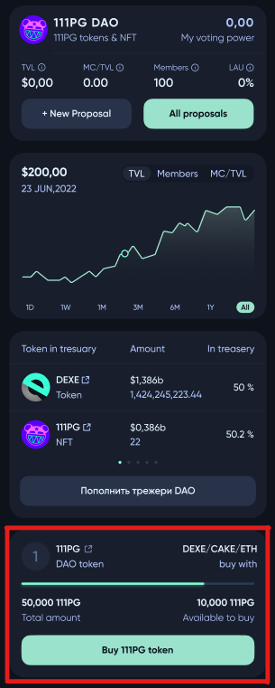
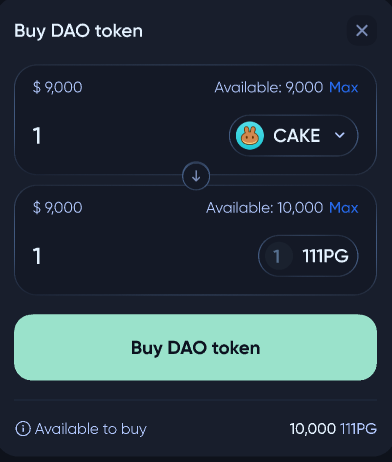
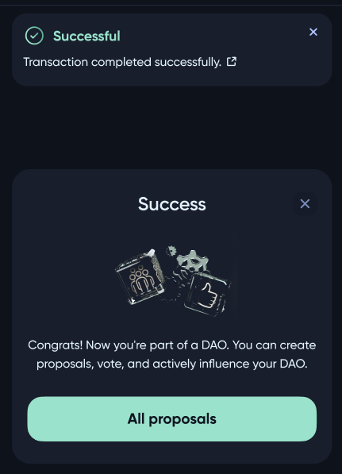

# How to buy DAO token on token sale

To buy a **DAO** pool token, user need to visit profile of this **DAO**. There, the user will be able to see the token sale proposals if there are any. 

In token sale proposal, the user will be able to conduct exchange using some token from the token sale proposal list and acquiring **DAO** token. After selecting tokens and their amount to be exchanged, press ***Buy DAO token***.

If you manage to buy **DAO** tokens successfully, you became a member of this **DAO**.

