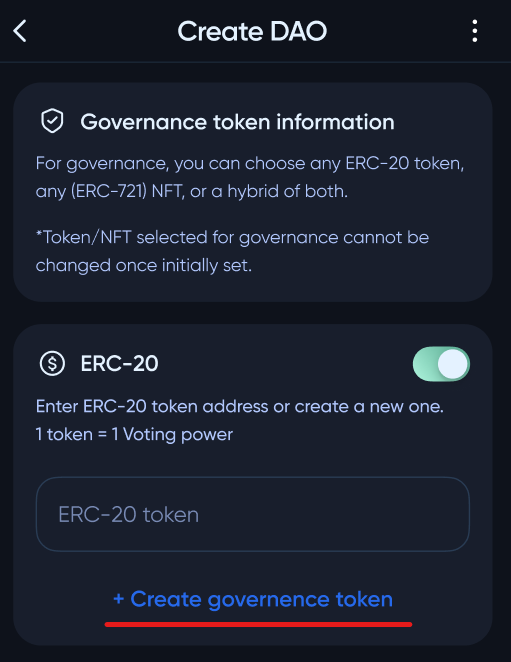
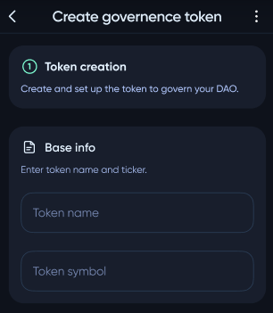
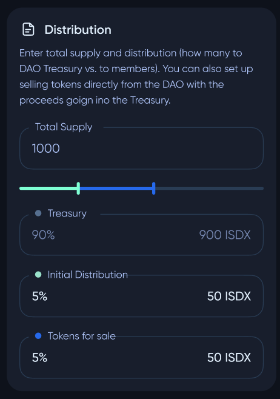
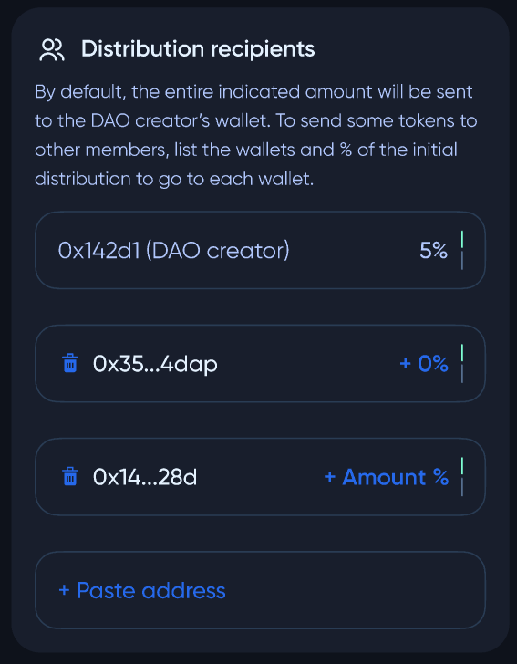
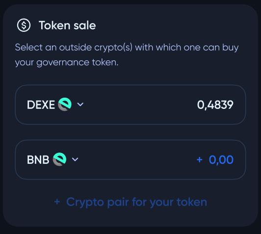

# Creating a governence token

While creating a **DAO** user may need to create a governence token first.

#

First step is to fill basic information about the token - token name and symbol.

The next step is to configure the token distribution parameters.

***Total supply*** - total amount of minted governance tokens
***Treasury*** - part of supply that will go to **DAO** pool treasury
***Initial Distribution*** - part of supply that will be distributed to DAO members immediately after **DAO** creation.
***Tokens for sale*** - tokens that that will be sold (exchanged for other tokens) to other users

By default, the entire amount of ***Initial Distribution*** tokens will be sent to the DAO creator's wallet. To reconfigure this, use `Distribution recipients` panel.

In `Token sale` panel, pool creator can select tokens that can be used to buy **DAO** native token and configure exchange rates.

