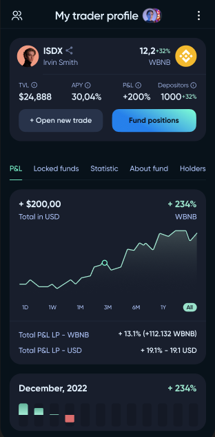
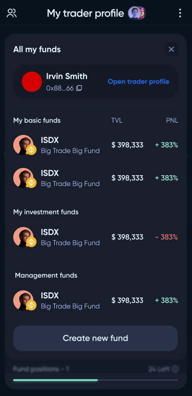
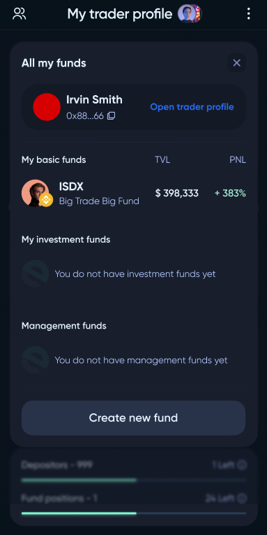
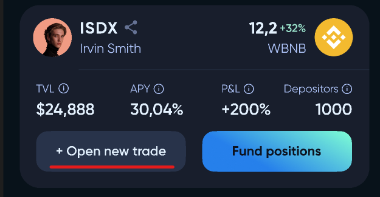
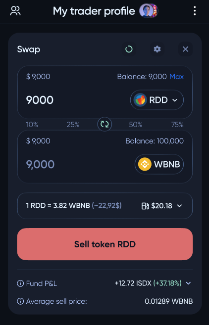
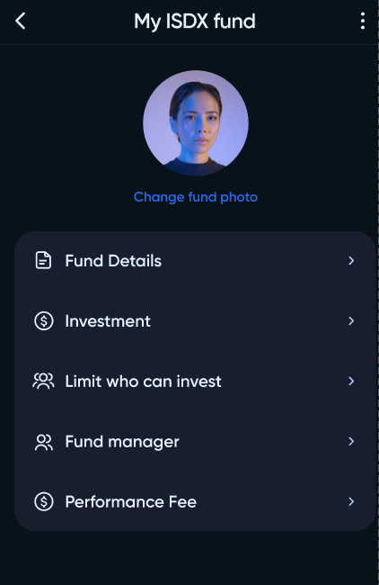

# Trader

The first step for trader is creating fund. The process is described on the `UserGuide/CreateFund` page.

The trader can manage multiple funds. The list of this finds located on the trader profile page.

To start trading and open new positions, trader must click `Open new trade` on the fund page.

The trading interface is similar to a regular swapper.

The owner of the fund can change its settings. 

